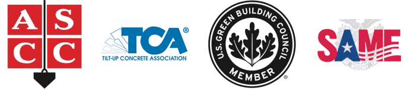

# Associations

### American Society of Concrete Contractors

The American Society of Concrete Contractors was formed by and for concrete contractors and others who provide services and goods to the industry. It is a powerful organization of contractors who share the same goals – to improve their businesses and their roles as contractors. Members include contracting firms, manufacturers, suppliers, designers and other professionals. There are over 500 member companies in the U.S. and abroad.

### Tilt-Up Concrete Association

Founded in 1986, the Tilt-Up Concrete Association (TCA) strives to improve the quality and acceptance of site-cast Tilt-Up construction, a method in which concrete wall panels are cast on-site and tilted into place. Tilt-Up construction is one of the fastest growing industries in the United States, combining the advantages of reasonable cost with low maintenance, durability, speed of construction and minimal capital investment. At least 10,000 buildings, enclosing more than 650 million square feet, are constructed each year using this construction method.

### U.S. Green Building Council

USGBC’s mission is to transform the way buildings and communities are designed, built and operated, enabling an environmentally and socially responsible, healthy, and prosperous environment that improves the quality of life.

The Washington, D.C.-based U.S. Green Building Council (USGBC) is a 501 c3 non-profit organization committed to a prosperous and sustainable future for our nation through cost-efficient and energy-saving green buildings..

### The Society of American Military Engineers (SAME)

Founded in 1920, The Society of American Military Engineers (SAME) is a professional engineering organization dedicated to connecting public decision makers to private sector companies and individuals in the architectural, engineering, construction and environmental disciplines. 

It is a dynamic group of more than 21,000 dedicated professionals who work to enhance our national security, and our nation’s facilities and infrastructure at home and abroad.



* [About]({{ site.url }}/about/)
* [Testimonials]({{ site.url }}/about/testimonials/index.html)

