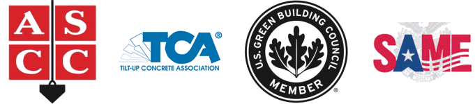

# ABOUT OUR COMPANY

Laredo Smart Management Ltd is the company that owns the trademark and has the master license rights to sell licenses to other businesses. Hi-Tech Tilt™ is a trade name that makes a reference to the tilt-up wall system.

We are patent pending in the following countries.

- ARIPO
- Australia
- Brazil
- China
- Costa Rica
- India
- Mexico
- New Zealand
- Nigeria
- OAPI / AIPO
- Russia
- South Africa

Hi-Tech Tilt™ has the support of several structural engineers who establish the stability and structural integrity of our product. This factor allows for quick approval by building officials throughout.

### Mission Statement

**“**To offer businesses the best in customer service, quality, innovation in design and construction, as well as fast-track building solutions with cost effectiveness, resulting in top quality buildings at an affordable price.**”**

### Associations



* [Association Info]({{ site.url }}/about/associations/index.html)
* [Testimonials]({{ site.url }}/about/testimonials/index.html)

